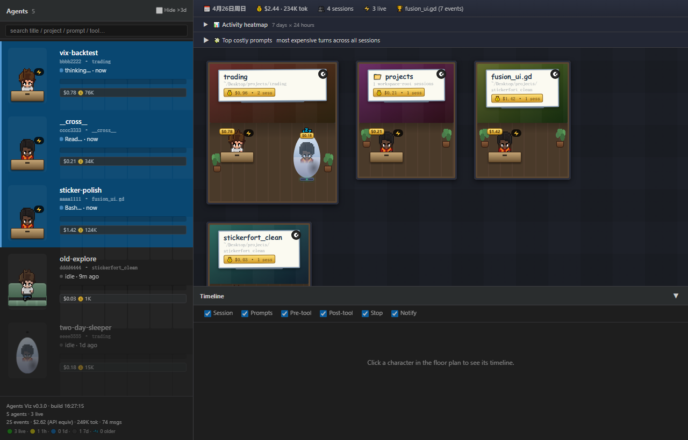

# Agents Viz

> VS Code 面板，把多个 Claude Code session 可视化成"项目房间里的像素小人"。
> 一眼看到谁在干啥、卡在哪、烧了多少钱。



> 上图：5 个并发 session 渲染效果。trading 房间左侧 char 在跑工具（⚡），
> 右侧蛋舱里是 2 天没动过的 session（💤），sidebar 显示项目名 + lifetime
> token + 当前活动，顶栏每日汇总（cost / sessions / live / top project）。

---

## 它解决什么问题

同时开着 5+ 个 Claude Code session 时（多项目并行 / ralph-loop / 探索 +
正经活），常见痛点：
- **不知道谁在干啥** — 切到每个终端 grep 历史太慢
- **卡死还在跑分不清** — `⏵` 转圈转 5 分钟，是真在思考还是死了？
- **烧钱无感** — 月底看账单傻眼
- **找不回上下文** — "上周哪个 session 讨论过 X？"

Agents Viz 在 VS Code 边栏开一个 panel：
- 🏠 每个项目一个房间，session 是房间里的像素角色
- ⚡/🔔/🔍/💤 状态徽章实时反映 busy/waiting/monitoring/idle
- 💰 头顶 lifetime cost 标签
- 📊 活动热力图 + 💸 烧钱 prompt 排行榜
- 🛏 长期静默 session 进入"睡眠仓"区，不占工作区位置

---

## 安装（开发版）

```bash
# 1. clone + 构建
cd ~/Desktop/projects/agents-viz/extension
npm install
npm run compile          # 一次性编译
# 或 npm run watch       # 开发时持续编译

# 2. 在 VS Code 里装
# 命令行：
code --install-extension agents-viz-0.0.1.vsix

# 或在 VS Code 里：
#   Extensions panel → ⋯ → "Install from VSIX..." → 选 agents-viz-0.0.1.vsix
```

源码改动需要：
1. `npm run compile`（或 watch 模式）→ 重新生成 `extension/dist/extension.js`
2. VS Code `Cmd/Ctrl+Shift+P → Developer: Reload Window`
3. 重新打开 panel

只改 `extension/webview.html` 时**不需要**重编 — 关闭再打开 panel 即可（webview HTML 每次重读磁盘）。

---

## 首次配置

打开 panel：`Cmd/Ctrl+Shift+P → Agents Viz: Open Panel`

第一次会显示空空的"等待 Claude Code 会话…"。需要给 Claude Code
配 hook 才能让 session 推数据进来：

```
Cmd/Ctrl+Shift+P → Agents Viz: Configure Claude Code Hooks
```

这会自动在 `~/.claude/settings.json` 里加 9 个 hook event 转发器
（SessionStart / UserPromptSubmit / PreToolUse / PostToolUse / Stop /
Notification / SubagentStop / Task / SessionEnd）。

每个 hook 都用 silent forwarder（< 5ms 延迟、0 token 消耗），通过本地
HTTP socket 把事件推给扩展。

配置完后**重启所有 Claude Code session**，事件就会开始流动。历史
session 数据通过扫描 `~/.claude/projects/*/<sid>.jsonl` 自动加载（带磁盘缓存）。

---

## 日常使用

### Floor plan（主区）
- 每个房间 = 一个项目，按文件投票自动分类（不看 cwd）
- 房间宽高随人物数量自动调整（`workCols × CHAR_W + podCols × POD_W`）
- 工作区在左、睡眠仓区在右
- 长期静默（>24h）的 session 自动进蛋舱（不占工作位）
- 跨项目编辑的 session 落 `📁 projects` hub

### Hover 角色
- Tooltip 显示 session id + cwd + 最近一条 user prompt（前 220 字）

### 顶栏
- 📅 今日花销 / token / 活跃 session 数 / 当前最忙项目
- 📊 **Activity heatmap** (7d × 24h) — 折叠展开
- 💸 **Top costly prompts** — 排行最烧钱的 user prompt，点击跳转

### Sidebar
- 搜索框 — 命中 title / project / sid / cwd / 最近 50 事件 tool/prompt
- Session 列表（缩略像素 + 状态）
- 点 session → 主区高亮 + 弹时间线抽屉

### Timeline drawer（底部）
- 选中 session 的事件流（SessionStart / UserPrompt / PreTool / PostTool / Stop / Notify）
- Tool color-coded
- 滚动到顶 → 可加载更早历史
- Subagent 事件嵌套显示在父 session 时间线里

---

## Configure / 自定义

### 房间外观
项目房间的"墙纸"可以放在 `extension/media/rooms/<project-name-lowercased>.png`，会自动作为该房间的背景图。文件不存在则用项目名 hash 出的渐变色。

### 角色精灵
6 个角色精灵在 `extension/media/characters-lpc-composed/char_{0..5}.png`
（来自 LPC 资产，由 `scripts/compose_lpc_characters.py` 合成）。可以替换成自己的 sprite，保持
`224 × 192 (7 cols × 3 rows of 32×64)` 布局即可。

### 阈值调整
代码里几个时间阈值可以改：
- `webview.html` 内 `STALE_MS = 60 * 60 * 1000` — 多久不动 → 沙发坐姿
- `LONG_STALE_MS = 24 * 60 * 60 * 1000` — 多久不动 → 蛋舱睡眠
- `ZOMBIE_MS = 60 * 60 * 1000` — 多久不动 → 强制清 busy/waiting flag

---

## Troubleshooting

| 现象 | 原因 | 解决 |
|------|------|------|
| Panel 一片空白 | 还没配 hook 或 session 还没产生事件 | `Configure Claude Code Hooks` + 重启 session |
| 只看到老 session 没新的 | hook 没配成功 | 检查 `~/.claude/settings.json` 里有 `agents-viz` 的 forwarder 路径 |
| 数字（cost）很小不真实 | 缓存破损或扫描未完成 | 删 `~/.agents-viz/usage-cache.json`，重开 panel |
| 改了 webview.html 没生效 | webview 还是旧 panel | 关闭 panel 再 `Open Panel`（HTML 是每次重读的，不用 reload window） |
| 改了 extension.ts 没生效 | extension.js 没重编 / VS Code 没重载 | `npm run compile` + `Developer: Reload Window` |
| 角色出现位置怪 / 一半在房外 | 公式 `CHAR_BOX` 不够（sub-pixel 舍入） | 调 webview.html 里的 CHAR_BOX 常量（默认 88，留 buffer 防 wrap） |

---

## 示例

### Hook event 长这样（forwarder 收到的 JSON，会 POST 给 extension）

```json
{
  "session_id": "0375b3da-52bf-4fc2-91a8-1325d0b79f39",
  "transcript_path": "C:\\Users\\X\\.claude\\projects\\hash\\sid.jsonl",
  "cwd": "C:\\Users\\X\\Desktop\\projects\\stickerfort_clean",
  "hook_event_name": "PreToolUse",
  "tool_name": "Edit",
  "tool_input": { "file_path": "C:\\...\\stickerfort\\scripts\\fusion_ui.gd" }
}
```

### 项目分类投票示例

一个 session 在 workspace 根目录开（cwd 一直 = `~/Desktop/projects`），
但用绝对路径编辑了 5 个 `idle_alchemist/*.gd` 和 3 个 `agents-viz/*.ts`：

| 信号 | 项目 | 权重 | 累计票 |
|------|------|------|--------|
| Edit × 5 | idle_alchemist | 5 each | 25 |
| Edit × 3 | agents-viz | 5 each | 15 |
| cwd × 200 events | (workspace root) | 0.2 | 不计票 (`'~'` 跳过) |

**结果**：runner-up (15) / leader (25) = 60% ≥ 30% → `__cross__` → 落 📁 projects hub。

如果只编辑 idle_alchemist（5 × 5 = 25, 没 agents-viz）→ 单一项目主导 → 落 idle_alchemist 房间。

### 房间尺寸示例

5 个 awake + 0 pod 的项目：
- workCols = round(√(5×2.0)) = round(3.16) = 3
- workRows = ceil(5/3) = 2
- workInner = 3×88 + 2×18 = 300px
- workBoxW = 300 + 36 (slot pad) = 336px
- roomW = 12 + 336 + 12 = **360px**
- workH = 2×70 + 14 = 154px
- roomH = 110 (wall) + 154 + 28 (floor pad) = **292px**
- 比例 360 × 292 → 横向，2 行 3 列布局 ✓

### 生成独立 preview HTML（无 VS Code 也能看 UI）

```bash
cd ~/Desktop/projects/agents-viz
PREVIEW_SELECTED=eeee5555 node scripts/export_webview_preview.js
# → screenshots/preview.html

# 然后用浏览器打开（注意 file:// 不行，需要 HTTP）
cd screenshots && python -m http.server 8765 &
# 浏览器打开 http://localhost:8765/preview.html
```

会用 5 个假 session（busy 中、waiting、idle、10min stale、2 day stale 各一）
渲染出整个 panel，方便调样式。

### 自定义房间墙纸

```bash
# 把项目专属背景图放在 media/rooms/<lowercase-project-name>.png
cp my_room_bg.png extension/media/rooms/stickerfort_clean.png

# webview.html 会自动 base64 嵌入并设为该房间背景
```

文件名小写，匹配 projectName 输出。没匹配到 → 用 hash(project) 出的 hsl 渐变。

---

## 代码结构 / 给开发者

详见 [`ARCHITECTURE.md`](ARCHITECTURE.md)。

简版 TL;DR：
- `extension/src/extension.ts` — 扩展宿主，HTTP hook 服务器 + 缓存 + 文件扫描
- `extension/src/webview.ts` — webview HTML 加载 + placeholder 替换
- `extension/webview.html` — **3000 行单文件**，所有 UI 逻辑（CSS + JS）
- `extension/src/hook-forwarder.js` — silent stdio → HTTP，每个 hook 进程的 entry
- `~/.agents-viz/` — 持久化数据（usage-cache.json + discovery 文件）
- `~/.claude/projects/<hash>/<sid>.jsonl` — Claude Code 写的 session 转录（我们读，不写）

---

## License

Personal project, no license yet. Don't redistribute.
